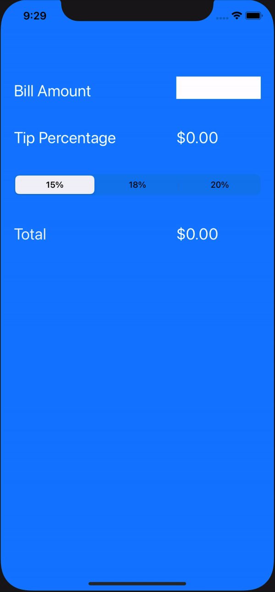

# Pre-work - *Tip Calculator*

**Tip Calculator** is a tip calculator application for iOS.

Submitted by: **Henry**

Time spent: **3** hours spent in total

## User Stories

The following **required** functionality is complete:

* [x] User can enter a bill amount, choose a tip percentage, and see the tip and total values.
* [x] User can select between tip percentages by tapping different values on the segmented control and the tip value is updated accordingly

## Video Walkthrough

Here's a walkthrough of implemented user stories:

- App Sucessfully computes tip and produces the correct output for large numbers.

GIF created with [LiceCap](http://www.cockos.com/licecap/).

## Notes

Describe any challenges encountered while building the app.
- Xcode interface was easy to grasp, everything was very intuitive. It's just a matter of knowing what's what and what's where 
- I had difficulty getting the numberpad to pop up when I edit the text field. 
    -  billAmountTextField.keyboardType = UIKeyboardType.default,   does not work...
## License

    Copyright [2020] [Henry]

    Licensed under the Apache License, Version 2.0 (the "License");
    you may not use this file except in compliance with the License.
    You may obtain a copy of the License at

        http://www.apache.org/licenses/LICENSE-2.0

    Unless required by applicable law or agreed to in writing, software
    distributed under the License is distributed on an "AS IS" BASIS,
    WITHOUT WARRANTIES OR CONDITIONS OF ANY KIND, either express or implied.
    See the License for the specific language governing permissions and
    limitations under the License.
